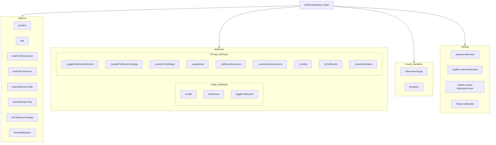

# [Leaflet FullScreen Button](https://sergeiown.github.io/Leaflet_FullScreen_Button/) 
[](https://sergeiown.github.io/Leaflet_FullScreen_Button/)

A Leaflet plugin for creating a button control with the functionality to activate full-screen mode. Simple and straightforward. Does not contain anything superfluous except for convenient and necessary options.

The idea came from a small project: **[Map_with_Marker_Clusters](https://github.com/sergeiown/Map_with_Marker_Clusters)** during the work on which there was a need to implement a full-screen mode but there was no desire to use existing plugins.

## [Table of Contents](#leaflet-fullscreen-button)

- [Class Diagram](#class-diagram)
- [API](#api)
- [Note](#note)
- [Browser Support](#browser-support)
- [Usage](#usage)
- [Example](#example)
- [License](#license)

## [Class Diagram](#leaflet-fullscreen-button)

This diagram encompasses various options for configuration, essential methods for functionality, registered event handlers for user interactions, and the associated styling for visual presentation. The components are organized to enhance understanding and provide a clear overview of the `FullScreenButton` class's design and purpose.



## [API](#leaflet-fullscreen-button)

| Option                    | Type       | Default                      | Description                                                                                  |
|---------------------------|------------|------------------------------|----------------------------------------------------------------------------------------------|
| `position`                | `String`   | `'topleft'`                  | Position of the button on the map. Possible values include: <br>- `'topleft'` <br>- `'topright'` <br>- `'bottomleft'` <br>- `'bottomright'` |
| `title`                   | `String`   | `'Toggle fullscreen mode'`   | The text of the button tooltip. This can be customized to any string value for better user guidance. |
| `enterFullScreenIcon`     | `String`   | `null`                       | Image path for the button to enter full screen mode. Supported formats include: <br>- PNG <br>- JPEG <br>- SVG <br>- Other web-supported image formats. |
| `exitFullScreenIcon`      | `String`   | `null`                       | Image path for the button to exit full screen mode. Supported formats include: <br>- PNG <br>- JPEG <br>- SVG <br>- Other web-supported image formats.  |
| `enterFullScreenTitle`    | `String`   | `'Enter fullscreen mode'`    | Prompt text for entering full-screen mode. This can be customized to any string value for clarity. |
| `exitFullScreenTitle`     | `String`   | `'Exit fullscreen mode'`     | The text of the prompt to exit full-screen mode. This can also be customized as needed. |
| `showNotification`        | `Boolean`  | `true`                       | Indicates whether to display a notification when switching to full screen mode. Possible values: <br>- `true` (notification displayed) <br>- `false` (notification not displayed) |
| `onFullScreenChange`      | `Function` | `null`                       | Callback function that is called when the fullscreen mode changes. This can accept any function reference to handle custom actions upon mode change. |

| Method                        | Returns             | Description                                                                                                                                  |
|-------------------------------|---------------------|----------------------------------------------------------------------------------------------------------------------------------------------|
| `toggleFullScreen(map: L.Map)`| `Promise<void>`     | Toggles the full screen mode state for the map. Uses different methods for requesting full screen mode depending on the browser.             | 

## [Note](#leaflet-fullscreen-button)

- The pseudo-fullscreen mode is used as an alternative method for simulating fullscreen mode in cases where direct API methods for fullscreen mode are not supported by the browser. A prime example is the Safari browser on iOS when used on an iPhone
- Behavior when pressing the F11 key has been changed to use the `toggleFullScreen(map: L.Map)` method

## [Browser Support](#leaflet-fullscreen-button)

| Browser          | Version | Support Description                                                                 |
|------------------|---------|-------------------------------------------------------------------------------------|
| **Chrome**       | 50+     | Full support of the fullscreen API.                                                 |
| **Firefox**      | 47+     | Full support of the fullscreen API.                                                 |
| **Edge**         | 15+     | Full support of the fullscreen API.                                                 |
| **Safari**       | 11+     | Full support of the fullscreen API, except on iOS.                                  |
| **Opera**        | 37+     | Full support of the fullscreen API.                                                 |
| **IE**           | 11      | Limited support using msRequestFullscreen/msExitFullscreen methods.                 |
| **iOS Safari**   | 11+     | Pseudo-fullscreen mode through CSS classes, as the fullscreen API is not supported. |
| **Android Browser** | 50+  | Full support of the fullscreen API.                                                 |

## [Usage](#leaflet-fullscreen-button)

- **Install [Leaflet](https://leafletjs.com/download.html) - an open-source JavaScript library for mobile-friendly interactive maps**

- **Add [leaflet.fullscreen.js](https://github.com/sergeiown/Leaflet_FullScreen_Button/tags) to the page**
```html
<script src="./leaflet.fullscreen.js"></script>
```

- **Initialize the map**
```javascript
const map = L.map('map').setView([49.1, 31.2], 5);
```

- **Add a layer**
```javascript
L.tileLayer('https://{s}.tile.openstreetmap.org/{z}/{x}/{y}.png', {
    attribution: '© OpenStreetMap contributors',
    minZoom: 4,
    maxZoom: 19,
}).addTo(map);
```

- **Add a new control for full screen mode with options of your choice**
```javascript
L.control.fullScreenButton({ position: 'topleft' }).addTo(map);
```
**or**
```javascript
L.control
    .fullScreenButton({
        position: 'topleft',
        title: 'your text',
        enterFullScreenIcon: 'path/to/enter-icon.svg',
        exitFullScreenIcon: 'path/to/exit-icon.svg',
        enterFullScreenTitle: 'your text',
        exitFullScreenTitle: 'your text',
        showNotification: true,
        onFullScreenChange: () => {
            'your function';
        },
    })
    .addTo(map);
```

- **You can call the toggleFullScreen method programmatically if necessary**
```javascript
const fullScreenControl = L.control.fullScreenButton();
fullScreenControl
    .toggleFullScreen(map)
    .then(() => {
        console.log('Full screen toggled');
    })
    .catch((err) => {
        console.error('Error toggling full screen:', err);
    });
```

## [Example](#leaflet-fullscreen-button)

**https://sergeiown.github.io/Leaflet_FullScreen_Button/**

## [License](#leaflet-fullscreen-button)

**[Copyright (c) 2024 Serhii I. Myshko](https://github.com/sergeiown/Leaflet_FullScreen_Button/blob/main/LICENSE)**
